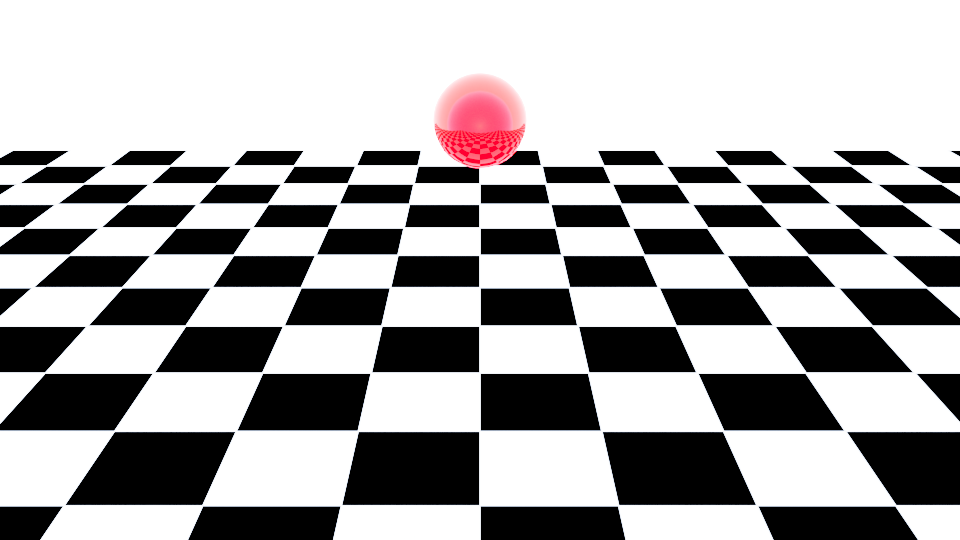

# VRay Command Line Render Test

This demo will render on the command line a vray scene exported from maya. 

The resultant render should be an exr that looks like this



The file test_vray.sh is designed to run on the lab build.

```
#!/usr/bin/env  bash
VRAY="/opt/autodesk/maya2023/vray/bin/vray.bin"
FARM_VRAY="/opt/software/vray_builds/maya_vray/bin/vray.bin"

export LD_LIBRARY_PATH=/opt/autodesk/maya2023/vray/lib/
export VRAY_AUTH_CLIENT_FILE_PATH=/opt
export VRAY_OSL_PATH=/opt/ChaosGroup/V-Ray/Maya2023-x64/opensl
$VRAY -sceneFile="TestVray_0120.vrscene" -display=0 -frames=1
```


